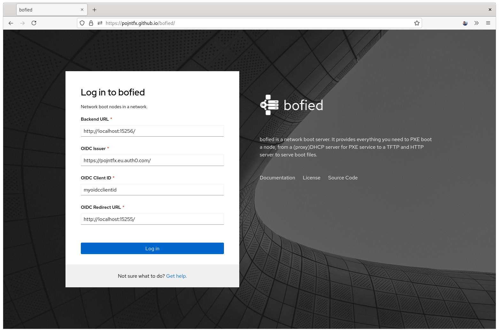
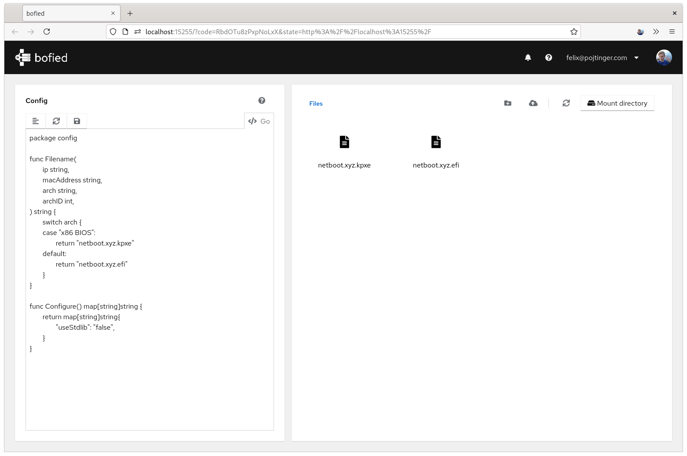
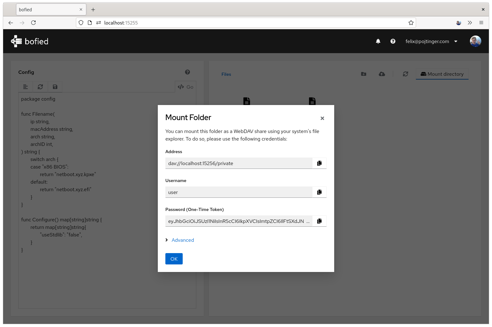
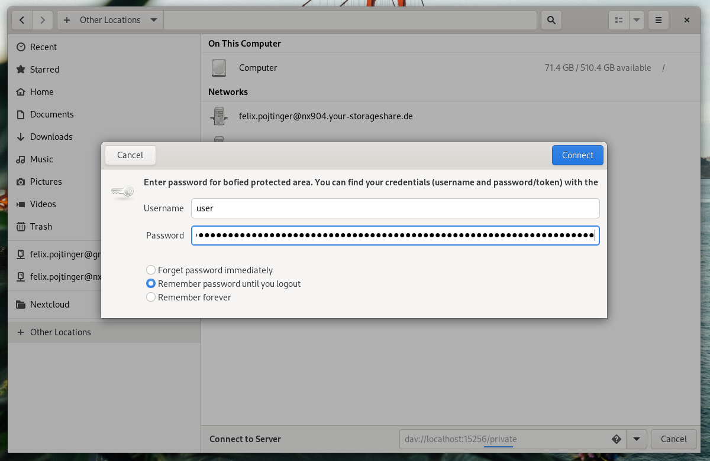
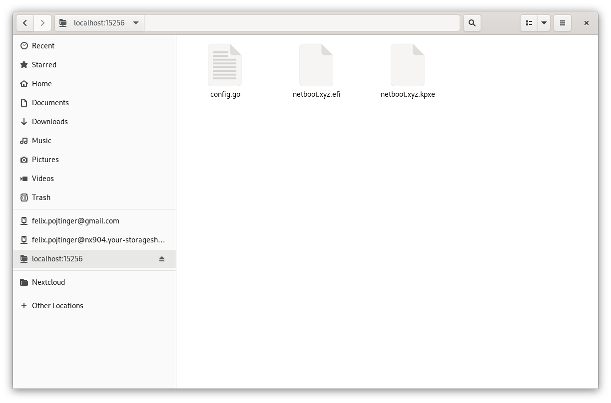

# bofied

🚧 This project is a work-in-progress! The documentation is not complete yet. 🚧

Network boot nodes in a network.

[](https://github.com/pojntfx/bofied/actions/workflows/hydrun.yaml)
[](https://github.com/pojntfx/bofied/actions/workflows/docker.yaml)
[](https://pkg.go.dev/github.com/pojntfx/bofied)
[](https://matrix.to/#/#bofied:matrix.org?via=matrix.org)

## Overview

bofied is a network boot server. It provides everything you need to PXE boot a node, from a (proxy)DHCP server for PXE service to a TFTP and HTTP server to serve boot files.

It enables you to ...

- **Boot nodes from the network**: Using (proxy)DHCP for PXE service, it can configure nodes which are set to network boot
- **Serve boot files**: The integrated TFTP and HTTP servers can provide the iPXE network bootloader, Linux distros or other boot files
- **Easily manage and script the network boot config**: By using the browser or WebDAV, boot files can be managed and the scriptable configuration can be edited
- **Monitor network boot**: By monitoring (proxy)DHCP and TFTP traffic, bofied can give an insight to the network boot process using a browser or the gRPC API
- **Remotely provision nodes**: Because bofied is based on open web technologies and supports OpenID Connect authentication, it can be securely exposed to the public internet and be used to manage network boot in a offsite location

## Installation

### Containerized

You can get the Docker container like so:

```shell
$ docker pull pojntfx/bofied-backend
```

### Natively

If you prefer a native installation, static binaries are also available on [GitHub releases](https://github.com/pojntfx/bofied/releases).

You can install them like so:

```shell
$ curl -L -o /tmp/bofied-backend https://github.com/pojntfx/bofied/releases/download/latest/bofied-backend.linux-$(uname -m)
$ sudo install /tmp/bofied-backend /usr/local/bin
$ sudo setcap cap_net_bind_service+ep /usr/local/bin/bofied-backend # This allows rootless execution
```

### About the Frontend

The frontend is also available on [GitHub releases](https://github.com/pojntfx/bofied/releases) in the form of a static `.tar.gz` archive; to deploy it, simply upload it to a CDN or copy it to a web server. For most users, this shouldn't be necessary though; thanks to [@maxence-charriere](https://github.com/maxence-charriere)'s [go-app package](https://go-app.dev/), bofied is a progressive web app. By simply visiting the [public deployment](https://pojntfx.github.io/bofied/) once, it will be available for offline use whenever you need it.

## Usage

### Setting up Authentication

bofied uses [OpenID Connect](https://en.wikipedia.org/wiki/OpenID_Connect) for authentication, which means you can use almost any authentication provider, both self-hosted and as a service, that you want to. We've created a short tutorial video which shows how to set up [Auth0](https://auth0.com/) for this purpose, but feel free to use something like [Ory](https://github.com/ory/hydra) if you prefer a self-hosted solution:

[](https://www.youtube.com/watch?v=N3cocCOsrGw)

### Verifying Port Availability

First, verify that ports `67/udp`, `4011/udp`, `69/udp`, `15256/tcp` and `15257/tcp` aren't in use by another app:

```bash
$ ss -tlnp | grep -E -- ':(15256|15257)'
$ ss -ulnp | grep -E -- ':(67|4011|69)'
```

Neither of these two commands should return anything; if they do, kill the process that listens on the port.

### Getting the Advertised IP

bofied integrates a (proxy)DHCP server, which advertises the IP address of the integrated TFTP server. To do so, you'll have to find out the IP of the node which is running bofied; you can find it with `ip a`:

```bash
$ ip -4 a
1: lo: <LOOPBACK,UP,LOWER_UP> mtu 65536 qdisc noqueue state UNKNOWN group default qlen 1000
    inet 127.0.0.1/8 scope host lo
       valid_lft forever preferred_lft forever
2: enp0s13f0u1u3: <BROADCAST,MULTICAST,UP,LOWER_UP> mtu 1500 qdisc fq_codel state UP group default qlen 1000
    inet 192.168.178.147/24 brd 192.168.178.255 scope global dynamic noprefixroute enp0s13f0u1u3
       valid_lft 862274sec preferred_lft 862274sec
```

In the following, we'll assume that `192.168.178.147` is the IP address of this node.

### Starting the Backend (Containerized)

Using Docker (or an alternative like Podman), you can now easily start & configure the backend; see the [Reference](#reference) for more configuration parameters:

```shell
$ docker run \
    --name bofied-backend \
    -d \
    --restart always \
    --cap-add NET_BIND_SERVICE \
    -p 67:67/udp \
    -p 4011:4011/udp \
    -p 69:69/udp \
    -p 15256:15256/tcp \
    -p 15257:15257/tcp \
    -v ${HOME}/.local/share/bofied:/root/.local/share/bofied:z \
    -e BOFIED_BACKEND_OIDCISSUER=https://pojntfx.eu.auth0.com/ \
    -e BOFIED_BACKEND_OIDCCLIENTID=myoidcclientid \
    -e BOFIED_BACKEND_ADVERTISEDIP=192.168.178.147 \
    pojntfx/bofied-backend
```

The logs are available like so:

```shell
$ docker logs bofied-backend
```

### Starting the Backend (Natively)

If you prefer a native setup, a non-containerized installation is also possible.

First, set up a config file at `~/.local/share/bofied/etc/bofied/bofied-backend-config.yaml`; see the [Reference](#reference) for more configuration parameters:

```shell
$ mkdir -p ~/.local/share/bofied/etc/bofied/
$ cat <<EOT >~/.local/share/bofied/etc/bofied/bofied-backend-config.yaml
oidcIssuer: https://pojntfx.eu.auth0.com/
oidcClientID: myoidcclientid
advertisedIP: 192.168.178.147
EOT
```

Now, create a systemd service for it:

```shell
$ mkdir -p ~/.config/systemd/user/
$ cat <<EOT >~/.config/systemd/user/bofied-backend.service
[Unit]
Description=bofied

[Service]
ExecStart=/usr/local/bin/bofied-backend -c \${HOME}/.local/share/bofied/etc/bofied/bofied-backend-config.yaml

[Install]
WantedBy=multi-user.target
EOT
```

Finally, reload systemd and enable the service:

```shell
$ systemctl --user daemon-reload
$ systemctl --user enable --now bofied-backend
```

You can get the logs like so:

```shell
$ journalctl --user -u bofied-backend
```

### Setting up the Firewall

You might also have to open up the ports on your firewall:

```shell
$ for port in 67/udp 4011/udp 69/udp 15256/tcp 15257/tcp; do sudo firewall-cmd --permanent --add-port=${port}; done
```

### Connecting the Frontend

Now that the backend is running, head over to [https://pojntfx.github.io/bofied/](https://pojntfx.github.io/bofied/). Alternatively, as described in [About the Frontend](#about-the-frontend), you can also choose to self-host. Once you're on the page, you should be presented with the following setup page:



You'll have to enter your own information here; the `Backend URL` is the URL on which the backend (`http://localhost:15256/` by default) runs, the `OIDC Issuer`, `Client ID` and `Redirect URL` are the same values that you've set the backend up with above.

Finally, click on `Login`, and if everything worked out fine you should be presented with the initial launch screen:



🚀 **That's it**! We hope you enjoy using bofied.

## Reference

### Command Line Arguments

```shell
$ bofied-backend --help
bofied is a network boot server. It provides everything you need to PXE boot a node, from a (proxy)DHCP server for PXE service to a TFTP and HTTP server to serve boot files.

For more information, please visit https://github.com/pojntfx/bofied.

Usage:
  bofied-backend [flags]

Flags:
      --advertisedIP string                IP to advertise for DHCP clients (default "100.64.154.246")
  -c, --configFile string                  Config file to use
      --dhcpListenAddress string           Listen address for DHCP server (default ":67")
      --extendedHTTPListenAddress string   Listen address for WebDAV, HTTP and gRPC-Web server (default ":15256")
      --grpcListenAddress string           Listen address for gRPC server (default ":15257")
  -h, --help                               help for bofied-backend
      --netbootBIOSURL string              Download URL for the BIOS https://netboot.xyz/ build of iPXE (default "https://boot.netboot.xyz/ipxe/netboot.xyz.kpxe")
      --netbootUEFIURL string              Download URL for the UEFI https://netboot.xyz/ build of iPXE (default "https://boot.netboot.xyz/ipxe/netboot.xyz.efi")
  -t, --oidcClientID string                OIDC client ID (default "myoidcclientid")
  -i, --oidcIssuer string                  OIDC issuer (default "https://pojntfx.eu.auth0.com/")
      --proxyDHCPListenAddress string      Listen address for proxyDHCP server (default ":4011")
  -p, --pureConfig Configuration           Prevent usage of stdlib in configuration file, even if enabled in Configuration function
  -s, --skipNetbootDownload                Don't initialize by downloading https://netboot.xyz/ on the first run
      --tftpListenAddress string           Listen address for TFTP server (default ":69")
  -d, --workingDir string                  Working directory (default "/home/pojntfx/.local/share/bofied/var/lib/bofied")
```

### Environment Variables

All command line arguments described above can also be set using environment variables; for example, to set `--advertisedIP` to `192.168.178.147` with an environment variable, use `BOFIED_BACKEND_ADVERTISEDIP=192.168.178.147`.

### Configuration File

Just like with the environment variables, bofied can also be configured using a configuration file; see [examples/bofied-backend-config.yaml](./examples/bofied-backend-config.yaml) for an example configuration file.

### Config Script

The config script is separate from the config file and is used to dynamically decide which file to send to which node based on it's IP address, MAC address and processor architecture. It can be set & validated using either the frontend or WebDAV. The default config script returns a PC x86 executable for x86 BIOS nodes and an EFI executable for all other nodes:

```go
package config

func Filename(
	ip string,
	macAddress string,
	arch string,
	archID int,
) string {
	switch arch {
	case "x86 BIOS":
		return "netboot.xyz.kpxe"
	default:
		return "netboot.xyz.efi"
	}
}

func Configure() map[string]string {
	return map[string]string{
		"useStdlib": "false",
	}
}
```

The script is just a small [Go](https://go.dev/) program which exports two functions: **`Filename`** and **`Configure`**. **`Configure`** is called to configure the interpreter; for example, if you want to use the standard library, i.e. to log information with `log.Println` or to make a HTTP request with `http.Get`, you can set `"useStdlib": "true",`. **`Filename`** is called with the IP address, MAC address and architecture (as a string and as an ID), and should return the name of the file to send to the booting node. The following architecture values are available (see [IANA Processor Architecture Types](https://www.iana.org/assignments/dhcpv6-parameters/dhcpv6-parameters.xhtml#processor-architecture)):

| `archID` Parameter | `arch` Parameter                   |
| ------------------ | ---------------------------------- |
| 0x00               | x86 BIOS                           |
| 0x01               | NEC/PC98 (DEPRECATED)              |
| 0x02               | Itanium                            |
| 0x03               | DEC Alpha (DEPRECATED)             |
| 0x04               | Arc x86 (DEPRECATED)               |
| 0x05               | Intel Lean Client (DEPRECATED)     |
| 0x06               | x86 UEFI                           |
| 0x07               | x64 UEFI                           |
| 0x08               | EFI Xscale (DEPRECATED)            |
| 0x09               | EBC                                |
| 0x0a               | ARM 32-bit UEFI                    |
| 0x0b               | ARM 64-bit UEFI                    |
| 0x0c               | PowerPC Open Firmware              |
| 0x0d               | PowerPC ePAPR                      |
| 0x0e               | POWER OPAL v3                      |
| 0x0f               | x86 uefi boot from http            |
| 0x10               | x64 uefi boot from http            |
| 0x11               | ebc boot from http                 |
| 0x12               | arm uefi 32 boot from http         |
| 0x13               | arm uefi 64 boot from http         |
| 0x14               | pc/at bios boot from http          |
| 0x15               | arm 32 uboot                       |
| 0x16               | arm 64 uboot                       |
| 0x17               | arm uboot 32 boot from http        |
| 0x18               | arm uboot 64 boot from http        |
| 0x19               | RISC-V 32-bit UEFI                 |
| 0x1a               | RISC-V 32-bit UEFI boot from http  |
| 0x1b               | RISC-V 64-bit UEFI                 |
| 0x1c               | RISC-V 64-bit UEFI boot from http  |
| 0x1d               | RISC-V 128-bit UEFI                |
| 0x1e               | RISC-V 128-bit UEFI boot from http |
| 0x1f               | s390 Basic                         |
| 0x20               | s390 Extended                      |
| 0x21               | MIPS 32-bit UEFI                   |
| 0x22               | MIPS 64-bit UEFI                   |
| 0x23               | Sunway 32-bit UEFI                 |
| 0x24               | Sunway 64-bit UEFI                 |

When bofied is first started, it automatically downloads [netboot.xyz](https://netboot.xyz/) to the boot file directory, so without configuring anything you can already network boot many Linux distros and other operating systems. This behavior can of course also be disabled; see [Reference](#reference).

### WebDAV

In addition to using the frontend to manage boot files, you can also mount them using [WebDAV](https://en.wikipedia.org/wiki/WebDAV). You can the required credentials by using the `Mount directory` button in the frontend:



Using a file manager like [Files](https://en.wikipedia.org/wiki/GNOME_Files), you can now mount the folder:



When transfering large files, using WebDAV directly is the recommended method.



### gRPC API

bofied exposes a streaming gRPC and gRPC-Web API for monitoring network boot, which is also in use internally in the frontend. You can find the relevant `.proto` files in [api/proto/v1](./api/proto/v1); send the OpenID Connect token with the `X-Bofied-Authorization` metadata key.

## Acknowledgements

- This project would not have been possible were it not for [@maxence-charriere](https://github.com/maxence-charriere)'s [go-app package](https://go-app.dev/); if you enjoy using bofied, please donate to him!
- The open source [PatternFly design system](https://www.patternfly.org/v4/) provides a professional design and reduced the need for custom CSS to a minimium (less than 30 SLOC!).
- [pin/tftp](https://github.com/pin/tftp) provides the TFTP functionality for bofied.
- [studio-b12/gowebdav](https://github.com/studio-b12/gowebdav) provides the WebDAV client for the bofied frontend.
- The [yaegi Go interpreter](https://github.com/traefik/yaegi) is used to securely evaluate the config script.
- All the rest of the authors who worked on the dependencies used! Thanks a lot!

## Contributing

To contribute, please use the [GitHub flow](https://guides.github.com/introduction/flow/) and follow our [Code of Conduct](./CODE_OF_CONDUCT.md).

To build and start a development version of bofied locally, run the following:

```shell
$ git clone https://github.com/pojntfx/bofied.git
$ cd bofied
$ make depend
$ BOFIED_BACKEND_OIDCISSUER=https://pojntfx.eu.auth0.com/ BOFIED_BACKEND_OIDCCLIENTID=myoidcclientid BOFIED_BACKEND_ADVERTISEDIP=192.168.178.147 make dev
```

The backend should now be started and the frontend be available on [http://localhost:15225/](http://localhost:15225/). Whenever you change a source file, the back- and frontend will automatically be re-compiled.

Have any questions or need help? Chat with us [on Matrix](https://matrix.to/#/#bofied:matrix.org?via=matrix.org)!

## License

bofied (c) 2021 Felix Pojtinger and contributors

SPDX-License-Identifier: AGPL-3.0
